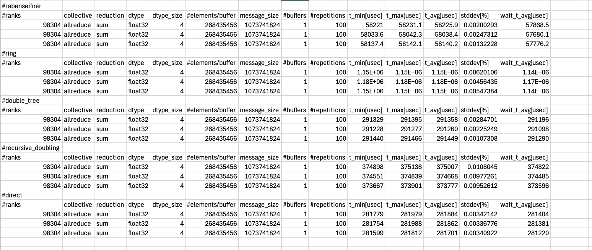

# DLComm all collectives scale stress benchmark

## Overview

This app captures the performance effects on major collectives (`allreduce`, `allgather`, `reduce-scatter`, `alltoall`, `broadcast`, `reduce`, `alltoallsingle`, `gather`, `scatter`, `barrier`) at scale reflecting the common workloads and parallelism degrees (tensor parallelism, data parallelism, sequence parallelism) commonly used in most AI-ML training schemes.

### Important Features

Here, we list the reasons why we need this benchmark

1. ***Realistic Communication Benchmarking:** DLComm* is a benchmarking framework designed to evaluate real-world collective communication performance in AI workloads, capturing the interplay between Python runtimes, threading models, AI frameworks, and collective communication libraries (CCLs). Unlike conventional MPI/OSU benchmarks, it reflects application-level communication patterns, making the results directly relevant to production environments.
2. **Focus on Collective Communication Bottlenecks:** Collective communication performance is often the primary limiting factor in large-scale AI training, inference, and reasoning workloads. This benchmark serves as a stress test to evaluate and enhance system resilience against network performance degradation at scale.
3. **Runtime and Backend Flexibility:** The framework allows rapid reconfiguration of different distributed runtimes (Pytorch/Jax) and CCL backends, as well as fine-grained control of scale-up and scale-out parallelism, algorithms, and payloads through a simple YAML interface, enabling targeted evaluation of network performance under varying software configurations. Built-in correctness verification facilitates early detection of numerical anomalies, such as NaNs, during large-scale operations.
4. **Comprehensive System Stress Testing:** *DLComm* provides the capability to stress-test a wide range of software, hardware and interconnect components involved in high-performance networking, enabling more thorough and representative system evaluations.

## FOM

We do not have a strictly defined FOM, but we measure several important characteristic quantities regarding collectives (i.e. Throughput, and latency timing measurement of each collective operations). The metrics obtained from this benchmark should be considered as a separate entity per task within the benchmark and should not be combined as a single averaged value for the entire run.

For reference, currently all reduce on 8192 (12ppn) Aurora nodes takes around 0.1 seconds for 1 GB payload.

 


## Steps to Run

This mini-app depends only on distributed runtime ( Pytorch / Jax ) and associated collective communication library for backends ( NCCL, XCCL, RCCL).

https://github.com/argonne-lcf/DLcomm_benchmark/

```
pip install DLcomm

mpiexec --np ${NRANKS} \
        -ppn ${RANKS_PER_NODE} \
        --depth 16 \
        --cpu-bind depth \
        python3 -m dl_comm.dl_comm_main --config-path="$SCRIPT_DIR" --config-name=6_all_collectives_scale 2>&1 | tee "$TERMINAL_LOG_FILE"

```

## Scale up Vs Scale out configuration

Set `comm_group: within_node` for scaleup benchmarks and `comm_group: across_node` for scale out benchmarks

## Some of the parameters that influence the performance projections are

Scale up:

1. Number of GPUs per compute node
2. Accelerator interconnect B/W
3. H2D and D2H PCIe B/W
4. GPU Memory - HBM
5. CPU Memory - DRAM

Scale out :

1. Number of compute nodes
2. Number of compute nodes per Rack
3. Number of NICs per compute node
4. NIC B/W
5. NIC attached to CPU/GPU
6. Number of switches per Compute Rack [copper cables Vs fiber optics]
7. Number of Switches/Routers per L2
8. Number of Switches/Routers per L1
9. DragonFly or Flat Tree topology
10. Ratio of number of dragon fly groups to compute racks
11. Adaptive dynamic routing
12. CCLs Ability to utilize ATL_TRANSPORT layer to ofi/libfabric instead of just mpi-direct
